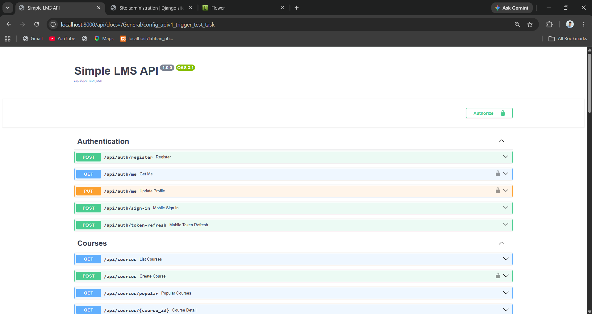
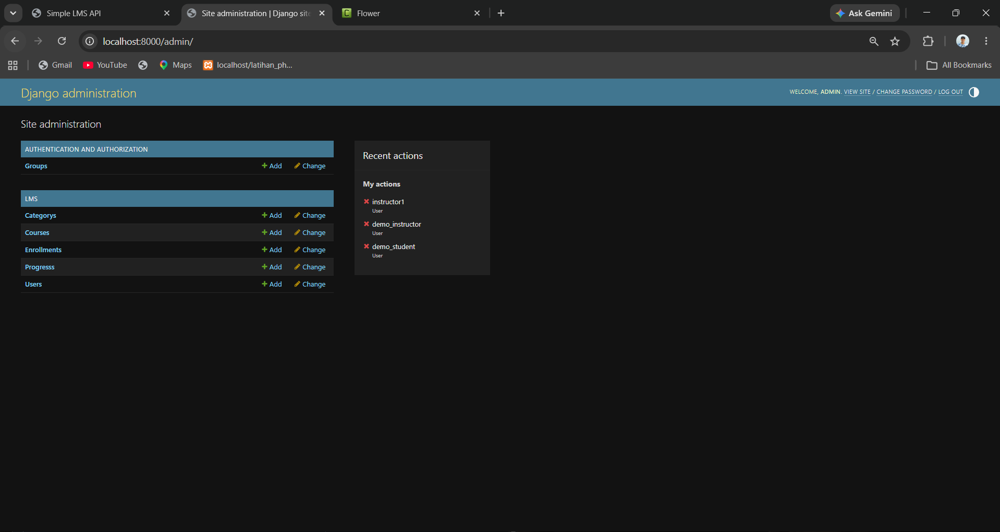
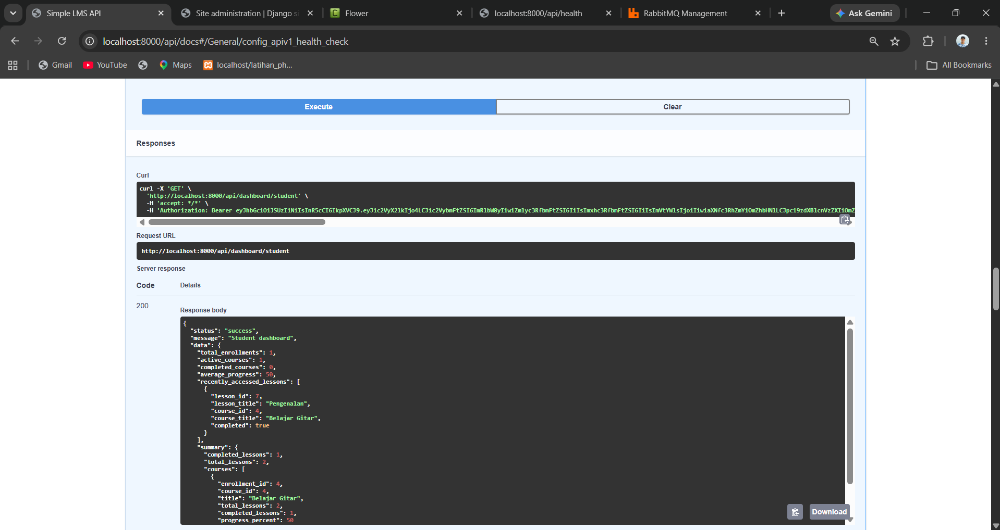
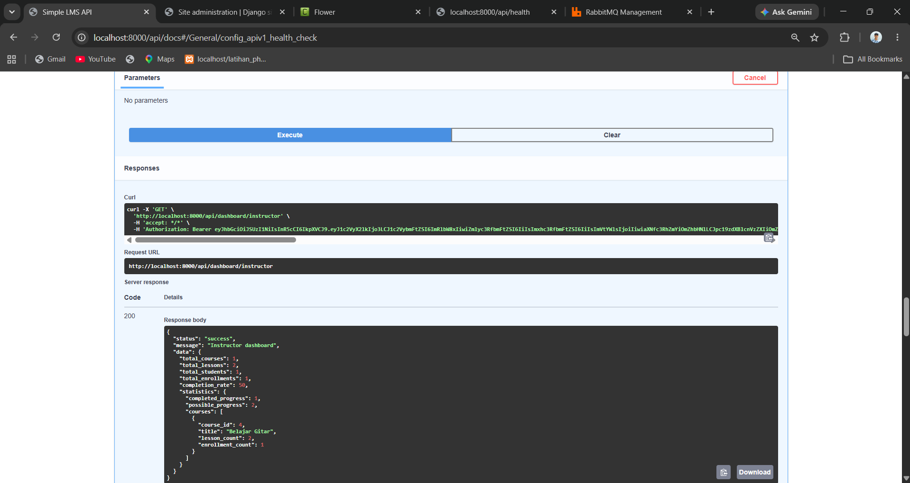
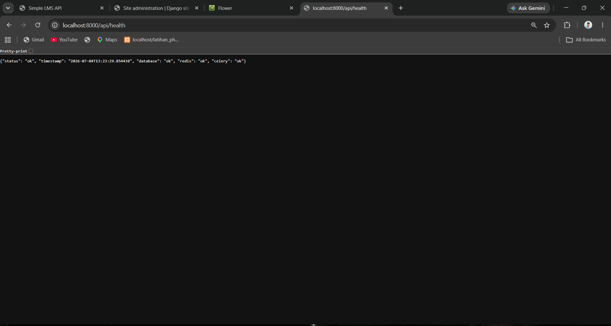
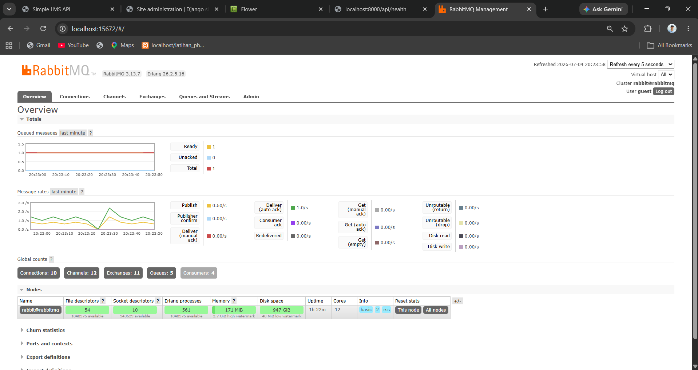
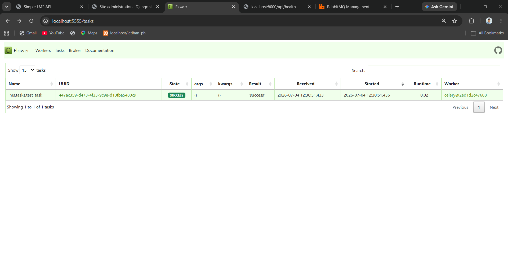
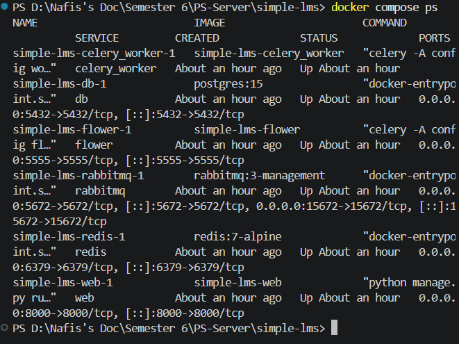
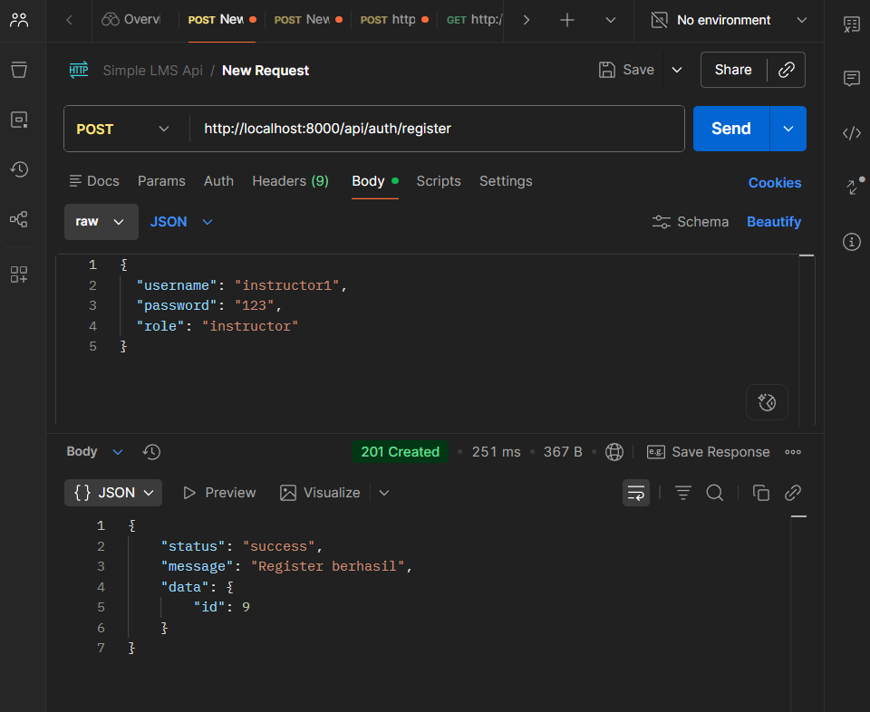
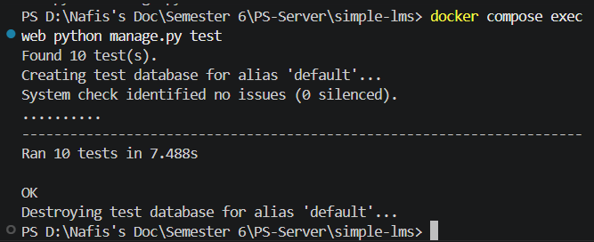

# FINAL PROJECT REPORT

---

## 1. Identitas

Nama : Muchamad Nafis Aljufri

NIM : A11.2023.15328

Kelas : A11.4602

Repository : https://github.com/nafisaljufri/simple-lms-UAS.git

---

## 2. Deskripsi Project

Simple LMS adalah sebuah sistem backend Learning Management System (LMS) berbasis REST API yang dikembangkan untuk memfasilitasi proses pembelajaran secara daring. Tujuan utama dari project ini adalah menyediakan layanan API yang efisien dan aman untuk mengelola Course, Lesson, Enrollment, dan Progress belajar dari Student. Sistem ini didesain untuk melayani tiga peran utama pengguna, yaitu Admin, Instructor, dan Student, dengan menggunakan mekanisme autentikasi dan otorisasi yang ketat.

Project ini dibangun dengan menggunakan framework Django dan Django Ninja untuk pengembangan API yang cepat dan berbasis tipe data (type hints). Sebagai penyimpanan data utama, project menggunakan PostgreSQL yang andal dalam menangani relasi data yang kompleks. Selain itu, sistem memanfaatkan Redis untuk proses caching dan penyimpanan sesi, serta menggunakan Celery bersama RabbitMQ untuk menangani eksekusi Background Task secara asinkron.

Secara arsitektur, backend dijalankan dalam lingkungan yang sepenuhnya terisolasi melalui Docker Compose, yang memudahkan proses deployment dan skalabilitas. Arsitektur modular dari project ini memisahkan logika autentikasi, manajemen konten, serta pemrosesan data, sehingga memudahkan pemeliharaan kode dan penambahan fitur di masa mendatang.

---

## 3. Fitur Dasar yang Sudah Berjalan

- [x] Authentication
- [x] Course CRUD
- [x] Lesson CRUD
- [x] Enrollment
- [x] Progress
- [x] Swagger
- [x] Docker
- [x] RBAC

---

## 4. Fitur Tambahan yang Dipilih

| No | Fitur | Kategori | Deskripsi Singkat | Status |
|---|---|---|---|---|
| 1 | Student Dashboard | Analytics | Agregasi data Enrollment, penyelesaian, dan Progress belajar | Selesai |
| 2 | Instructor Dashboard | Analytics | Agregasi statistik Course, jumlah Student, dan rasio penyelesaian | Selesai |
| 3 | Image & Attachment Upload | Content | Mendukung Upload file gambar Course dan berkas materi Lesson | Selesai |
| 4 | Redis Cache & Popular Courses | Performance | Caching untuk Course detail dan peringkat Course terpopuler secara real-time | Selesai |
| 5 | Celery & RabbitMQ | Infrastructure | Pemrosesan tugas secara asinkron untuk tugas berat di latar belakang | Selesai |
| 6 | Flower Monitoring | Monitoring | Dashboard berbasis web untuk memantau tugas asinkron Celery | Selesai |
| 7 | Health Check Endpoint | Monitoring | Endpoint untuk memvalidasi status koneksi Database, Redis, dan Celery | Selesai |
| 8 | Seed Demo Command | Developer Tools | Perintah otomatis untuk mengisi Database dengan data awal demo | Selesai |

---

## 5. Penjelasan Implementasi

### Role-Based Access Control (RBAC)
Implementasi RBAC dibangun untuk membatasi akses ke berbagai sumber daya berdasarkan peran (Admin, Instructor, Student, dan Anonymous). Pada tingkat kode, digunakan pemeriksaan peran (role checking) di setiap Endpoint untuk memastikan bahwa pengguna hanya dapat memodifikasi atau mengakses data yang menjadi hak mereka, seperti Instructor yang hanya dapat mengubah Course miliknya sendiri.

### Dashboard
Dua Dashboard terpisah disediakan untuk memfasilitasi kebutuhan pengguna yang berbeda. Student Dashboard menghitung persentase Progress penyelesaian pelajaran dari Course yang didaftarkan. Instructor Dashboard memberikan agregasi data pendaftaran dan rasio penyelesaian secara keseluruhan dari Course yang dibuat oleh Instructor tersebut. Keduanya meminimalisir proses komputasi berulang di sisi frontend.

### Redis
Redis digunakan dalam project dengan beberapa fungsi strategis. Pertama, menerapkan Cache-aside pattern untuk mempercepat respon saat mengambil detail Course. Kedua, menyimpan riwayat kunjungan (visit history) berdasarkan sesi pengguna. Ketiga, memanfaatkan tipe data Sorted Sets (ZINCRBY, ZREVRANGE) untuk menyajikan peringkat Course yang paling sering didaftarkan secara real-time tanpa membebani query Database relasional.

### RabbitMQ
RabbitMQ diimplementasikan sebagai message broker yang andal. Tujuan utamanya adalah untuk menjembatani pengiriman pesan (task) antara aplikasi utama Django dan Worker Celery. Sistem ini memastikan bahwa semua pesan tidak hilang dan dieksekusi secara berurutan atau bersamaan tergantung konfigurasi ketersediaan Worker.

### Celery
Celery diterapkan untuk menangani eksekusi Background Task secara asinkron. Tugas-tugas yang membutuhkan waktu pemrosesan lama tidak akan menghalangi siklus *request-response* dari HTTP, melainkan dikirim ke RabbitMQ dan diproses di latar belakang oleh Worker Celery.

### Flower
Flower diintegrasikan ke dalam Docker Compose sebagai alat pemantauan berbasis web (Monitoring). Flower berjalan pada port 5555 dan memungkinkan developer atau sistem administrator untuk melihat status, tingkat keberhasilan, dan waktu eksekusi dari setiap tugas Celery yang dikerjakan secara asinkron.

### Health Check
Endpoint Health Check (`GET /api/health`) diimplementasikan untuk menyediakan transparansi status infrastruktur. Endpoint ini memvalidasi dan mengembalikan status koneksi dari komponen vital (PostgreSQL, Redis, dan Celery). Ini mempermudah pemantauan jika ada kegagalan layanan yang tersembunyi.

### Docker Compose
Seluruh infrastruktur (Django web, PostgreSQL, Redis, RabbitMQ, Celery Worker, dan Flower) dikonfigurasi melalui sebuah berkas `docker-compose.yml`. Hal ini menstandarisasi lingkungan pengembangan dan memastikan bahwa proyek dapat dibangun (build) serta dijalankan secara konsisten oleh siapa pun hanya dengan satu perintah.

### Upload Feature
Fitur Upload diimplementasikan pada dua Endpoint terpisah menggunakan objek `UploadedFile` dari Django Ninja. Pertama untuk melakukan upload gambar pada Course, dan yang kedua untuk mengunggah berkas lampiran (Attachment) pada Lesson. File-file tersebut divalidasi ukurannya dan tipe ekstensinya sebelum disimpan ke dalam penyimpanan media (media storage) lokal proyek.

### Seed Demo
Perintah manajemen khusus `python manage.py seed_demo` ditulis untuk memfasilitasi demonstrasi aplikasi. Skrip ini menghasilkan entri data awal untuk kategori, pengguna, Course, dan Lesson secara *idempotent*, sehingga dapat dijalankan berulang kali tanpa membuat data ganda yang menyebabkan redundansi atau kesalahan *unique constraint* di dalam Database.

---

## 6. Cara Menjalankan Project

Berikut adalah langkah-langkah untuk menjalankan project dari awal:

1. **Clone Repository**
   ```bash
   git clone <URL_REPOSITORY>
   cd simple-lms
   ```

2. **Persiapan Environment**
   Salin file konfigurasi *environment variables*.
   ```bash
   cp .env.example .env
   ```

3. **Membangun dan Menjalankan Docker Compose**
   Pastikan Docker Desktop aktif, kemudian jalankan seluruh *service*.
   ```bash
   docker compose up --build -d
   ```

4. **Eksekusi Database Migration**
   Terapkan skema tabel ke dalam PostgreSQL.
   ```bash
   docker compose exec web python manage.py migrate
   ```

5. **Menjalankan Seed Demo (Opsional namun direkomendasikan)**
   Buat data awal secara otomatis untuk tujuan pengujian.
   ```bash
   docker compose exec web python manage.py seed_demo
   ```

6. **Akses Aplikasi dan Swagger**
   Aplikasi API akan berjalan dan menerima *request* secara otomatis.
   - Buka dokumentasi Swagger di: `http://localhost:8000/api/docs`

---

## 7. Akun Demo

Gunakan akun berikut jika Anda menjalankan perintah `seed_demo`:

**Admin**
Username : 
Password : 

**Instructor**
Username : 
Password : 

**Student**
Username : 
Password : 

---

## 8. Endpoint Penting

| Modul | Endpoint | Method | Deskripsi |
|---|---|---|---|
| Authentication | `/api/auth/login` | POST | Mengautentikasi pengguna dan mengembalikan Access Token JWT |
| Course | `/api/courses` | GET | Mendapatkan daftar Course (mendukung pagination, search, dan filter) |
| Course | `/api/courses` | POST | Membuat Course baru (khusus Instructor/Admin) |
| Lesson | `/api/lessons` | POST | Membuat Lesson baru di dalam sebuah Course |
| Enrollment | `/api/enrollments` | POST | Mendaftarkan Student ke dalam suatu Course |
| Progress | `/api/enrollments/{id}/progress` | POST | Menandai suatu Lesson sebagai selesai oleh Student |
| Dashboard | `/api/dashboard/student` | GET | Mengambil data statistik belajar milik Student |
| Health Check | `/api/health` | GET | Memeriksa ketersediaan Database, Redis, dan Celery |

---

## 9. Screenshot / Bukti Pengujian

Berikut merupakan dokumentasi hasil pengujian dan implementasi fitur-fitur utama pada project **Simple LMS Backend**. Seluruh screenshot di bawah ini menunjukkan bahwa sistem telah berhasil dijalankan dan setiap komponen utama berfungsi sesuai dengan implementasi yang telah dibuat.

---

### 9.1 Swagger UI

Swagger UI digunakan sebagai dokumentasi interaktif REST API. Seluruh endpoint dapat diuji secara langsung melalui antarmuka ini sehingga memudahkan proses pengembangan dan pengujian API.




---

### 9.2 Django Admin

Django Admin digunakan untuk mengelola data aplikasi seperti pengguna, course, lesson, enrollment, dan progress melalui antarmuka administrasi bawaan Django.




---

### 9.3 Student Dashboard

Endpoint Student Dashboard menampilkan ringkasan aktivitas belajar mahasiswa, seperti jumlah course yang diikuti, progress pembelajaran, rata-rata penyelesaian course, serta informasi lesson yang terakhir diakses.




---

### 9.4 Instructor Dashboard

Endpoint Instructor Dashboard menampilkan informasi statistik course yang dimiliki instructor, jumlah lesson, jumlah student yang mengikuti course, serta tingkat penyelesaian pembelajaran.




---

### 9.5 Health Check

Endpoint Health Check digunakan untuk memverifikasi kondisi layanan utama seperti PostgreSQL, Redis, Celery, serta memastikan backend berjalan dengan baik.




---

### 9.6 RabbitMQ

RabbitMQ berfungsi sebagai message broker yang menghubungkan aplikasi dengan Celery untuk menjalankan background task secara asynchronous.




---

### 9.7 Flower

Flower merupakan dashboard monitoring Celery yang digunakan untuk memantau status background task yang dikirimkan melalui RabbitMQ.




---

### 9.8 Docker Compose

Docker Compose digunakan untuk menjalankan seluruh service aplikasi, meliputi Django, PostgreSQL, Redis, RabbitMQ, Celery Worker, dan Flower dalam satu lingkungan terintegrasi.




---

### 9.9 Postman Testing

Postman Collection digunakan untuk melakukan pengujian endpoint REST API secara manual. Seluruh endpoint utama berhasil dijalankan dan memberikan respons sesuai dengan implementasi sistem.




---

### 9.10 Automated Testing

Automated Testing dilakukan menggunakan Django Test Framework untuk memastikan fungsi-fungsi utama sistem berjalan dengan benar. Seluruh pengujian berhasil dijalankan tanpa error.




---

## 10. Kendala dan Solusi

| Kendala | Solusi |
|---|---|
| Konfigurasi jalur kunci (key path) file penandatanganan JWT menyebabkan *FileNotFoundError* saat dijalankan di dalam kontainer Docker. | Memperbarui blok pengaturan `NINJA_SIMPLE_JWT` pada `settings.py` untuk menggunakan path absolut (memanfaatkan variabel `BASE_DIR`), sehingga resolusi berkas tidak terpengaruh oleh konteks direktori aktif layanan WSGI. |
| Pengujian progress pembelajaran terkadang diisi dengan ID Lesson yang sebenarnya tidak termasuk dalam daftar modul Course terkait. | Mengimplementasikan pemeriksaan validasi pada logika Progress (`lesson.course_id != enrollment.course_id`) untuk menolak *request* (mengembalikan HTTP 400) bila Student merekam progres pada Lesson dari Course yang salah. |
| Kesalahan *syntax* eksekusi saat developer mencoba menjalankan rentetan perintah pada terminal shell bawaan OS Windows. | Mengeksekusi perintah shell (seperti testing atau instalasi) secara terpisah atau bergantung penuh pada perantara shell berbasis Linux dari layanan kontainer Docker `web`. |

---

## 11. Kesimpulan

Pengembangan Simple LMS telah secara sukses menghasilkan infrastruktur REST API yang kuat, modular, dan sesuai dengan standar aplikasi berbasis produksi modern. Semua target objektif telah berhasil diintegrasikan dengan matang, mencakup arsitektur berlapis yang didukung oleh penyimpanan primer PostgreSQL dan akselerasi data yang efisien dari Redis Cache. Kombinasi JWT Authentication dan fungsionalitas Role-Based Access Control (RBAC) yang detail memastikan tingkat keamanan dan otorisasi yang aman pada berbagai rentang akses fitur pengguna dari sisi hulu.

Di samping pemrosesan siklus *request-response* standar, sistem telah berhasil berevolusi dari sekadar aplikasi *monolithic* tradisional dengan menyematkan komponen arsitektur asinkron di belakang layar. Celery dan RabbitMQ secara kolaboratif bekerja menangani Background Task, menjaga API agar tetap *responsive* meski harus memproses beban tambahan secara internal. Dashboard dan fungsi monitoring (Flower, Health Check) memberikan visibilitas administrasi penuh akan keandalan dari semua layanan terdistribusi ini dalam lingkungan berbasis Docker Compose.

Project backend ini memiliki pondasi pengembangan yang sangat fleksibel dan dioptimalkan dari awal (by design) agar ramah akan skalabilitas tinggi di masa depan. Struktur ini sangat mudah dikembangkan lebih lanjut—misalnya integrasi pengiriman email asinkron, migrasi manajemen *file attachment* secara vertikal ke Object Storage, hingga ekspansi logika analitik mendalam—menjadikannya solusi sistem backend edukasi yang sempurna dan efisien. 
