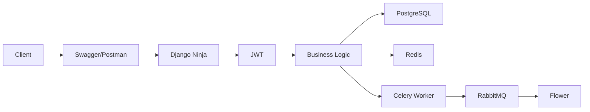
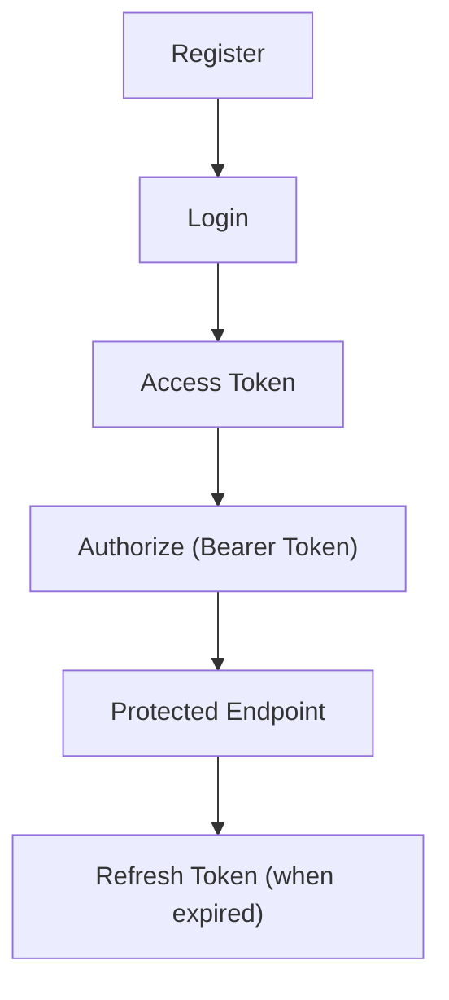

# Simple LMS

Backend RESTful Learning Management System (LMS) berkualitas produksi yang dibangun menggunakan Django Ninja. Project ini menyediakan API yang kuat untuk mengelola Course, Lesson, Enrollment, dan Progress tracking bagi pengguna. Selain itu, project ini dilengkapi dengan Role-Based Access Control (RBAC) yang komprehensif, Redis Cache, serta pemrosesan Background Task secara asinkron melalui Celery dan RabbitMQ.

## Project Highlights

Project ini memiliki beberapa fitur utama yang menjadi nilai tambah dibanding implementasi LMS dasar.

- JWT Authentication
- Role-Based Access Control (Admin, Instructor, Student)
- Course & Lesson CRUD
- Student Dashboard
- Instructor Dashboard
- Redis Cache
- RabbitMQ
- Celery
- Flower Monitoring
- Docker Compose Deployment
- Swagger API Documentation
- Postman Collection
- Automated Testing
- Seed Demo Command

---

# Features

### Authentication
- **Register**: Pendaftaran pengguna yang aman.
- **Login (JWT)**: Autentikasi berbasis Token menggunakan `ninja-simple-jwt`.
- **Refresh Token**: Pembaruan Token secara otomatis tanpa kendala.
- **Profile**: Melihat dan memperbarui data Profile pengguna.

### Role Based Access Control
- **Admin**: Akses penuh ke seluruh sumber daya dan tugas administratif.
- **Instructor**: Membuat dan mengelola Course dan Lesson milik mereka sendiri.
- **Student**: Melakukan Enrollment pada Course, melihat konten, dan melacak Progress pembelajaran.
- **Anonymous**: Akses hanya baca untuk melihat daftar Course dan Lesson publik.

### Course Management
- Operasi CRUD penuh.
- Upload gambar (image Upload).
- Kemampuan Search, Filtering, dan Sorting.
- Pelacakan kunjungan (visit tracking).

### Lesson Management
- Operasi CRUD penuh.
- Upload dan Download berkas (Attachment) secara aman.
- Pengaturan urutan Lesson di dalam Course.

### Enrollment
- Student dapat melakukan Enrollment pada Course yang tersedia secara aman.
- Endpoint khusus untuk melihat daftar Course yang telah terdaftar.

### Progress Tracking
- Student dapat menandai Lesson secara individual sebagai selesai.
- Validasi untuk memastikan Student hanya dapat melacak Progress untuk Course yang sudah di-Enrollment.

### Dashboards
- **Student Dashboard**: Tampilan agregat dari Course aktif/selesai, Progress terbaru, dan persentase penyelesaian.
- **Instructor Dashboard**: Tampilan agregat dari statistik Course, Enrollment dari Student, dan tingkat penyelesaian secara keseluruhan.

### Redis Integration
- Pola Cache-aside untuk detail Course.
- Penggunaan tipe data Sorted Sets untuk papan peringkat "Popular Courses" secara real-time.
- Pelacakan riwayat (history) berbasis Session.

### Celery Integration
- Pemrosesan Background Task secara asinkron (misalnya, pemeliharaan latar belakang atau tugas Testing).

### Monitoring
- Dashboard Flower untuk memonitoring Celery Worker.
- Endpoint Health Check untuk status Database, Redis, dan Celery.

### Docker Deployment
- Lingkungan containerized yang diorkestrasi menggunakan Docker Compose.

### Documentation
- Dokumentasi Swagger OpenAPI yang interaktif.
- Koleksi Postman yang komprehensif.

### Testing
- Automated Testing untuk unit dan integrasi guna memverifikasi RBAC dan logika bisnis.

### Demo Utilities
- Perintah manajemen Django yang idempoten untuk melakukan Seed data demo.

---

# Feature Matrix

| Fitur | Status |
|----------|--------|
| JWT Authentication | ✅ |
| RBAC | ✅ |
| Course CRUD | ✅ |
| Lesson CRUD | ✅ |
| Enrollment | ✅ |
| Progress | ✅ |
| Student Dashboard | ✅ |
| Instructor Dashboard | ✅ |
| Redis Cache | ✅ |
| RabbitMQ | ✅ |
| Celery | ✅ |
| Flower | ✅ |
| Health Check | ✅ |
| Docker | ✅ |
| Swagger | ✅ |
| Postman | ✅ |

---

# Technology Stack

| Komponen | Teknologi |
|---|---|
| **Core Framework** | Python 3.11, Django 5.2 |
| **API Framework** | Django Ninja 1.1 |
| **Authentication** | ninja-simple-jwt |
| **Database** | PostgreSQL 15 |
| **Cache & Session** | Redis 7 |
| **Message Broker** | RabbitMQ 3 |
| **Task Queue** | Celery & Flower |
| **Containerization** | Docker & Docker Compose |

---

## Why These Technologies?

| Teknologi | Fungsi |
|------------|---------|
| Django Ninja | REST API Framework |
| PostgreSQL | Primary relational Database |
| JWT | Stateless Authentication |
| Redis | Cache and Session Storage |
| RabbitMQ | Message Broker |
| Celery | Background Task Processing |
| Flower | Celery Monitoring Dashboard |
| Docker Compose | Multi-container orchestration |

---

# System Architecture



---

# Project Structure

```text
simple-lms/
├── config/
│   ├── settings.py
│   ├── apiv1.py
│   ├── urls.py
│   └── celery.py
├── lms/
│   ├── models.py
│   ├── tasks.py
│   ├── tests.py
│   ├── management/
│   └── migrations/
├── img/
├── postman/
├── Dockerfile
├── docker-compose.yml
├── requirements.txt
└── README.md
```

- **`config/`**: Berisi konfigurasi inti project, pengaturan Django, API router, dan skema Pydantic.
- **`lms/`**: Berisi logika bisnis aplikasi utama, model, tugas Celery, Automated Testing, dan perintah manajemen.
- **`img/`**: Menyimpan tangkapan layar (screenshot) markdown yang digunakan dalam dokumentasi.
- **`postman/`**: Menyimpan koleksi Postman yang diekspor untuk pengujian Endpoint secara manual.

---

# Installation

### 1. Environment
Salin contoh variabel environment:
```bash
cp .env.example .env
```

### 2. Docker
Pastikan Docker Desktop sedang berjalan, lalu bangun dan jalankan semua layanan:
```bash
docker compose up --build -d
```

### 3. Migration
Jalankan Migration Database awal:
```bash
docker compose exec web python manage.py migrate
```

### 4. Seed Demo
Isi Database dengan data demo untuk pengguna, Course, dan Lesson:
```bash
docker compose exec web python manage.py seed_demo
```

### 5. Run Server
Server berjalan secara otomatis melalui Docker pada port `8000`. Anda dapat memantau log dengan perintah:
```bash
docker compose logs -f web
```

---

# API Documentation

- **Swagger URL**: [http://localhost:8000/api/docs](http://localhost:8000/api/docs)
- **OpenAPI URL**: [http://localhost:8000/api/openapi.json](http://localhost:8000/api/openapi.json)

---

# Authentication Flow



---

# RBAC

### Anonymous
- Dapat melihat Endpoint API Health Check dan sapaan (hello).
- Dapat melihat dan melakukan Search pada Course dan Lesson.
- Dapat melihat detail Course dan Lesson.
- Dapat melihat Popular Course dan riwayat kunjungan.

### Student
- Mewarisi hak akses (Permission) Anonymous.
- Dapat melakukan Enrollment pada Course.
- Dapat melihat daftar Course yang di-Enrollment.
- Dapat menandai Lesson sebagai selesai (hanya untuk Course yang di-Enrollment).
- Dapat mengakses Student Dashboard.
- Dapat melakukan Download pada Lesson Attachment.

### Instructor
- Mewarisi hak akses (Permission) baca dari Student.
- Dapat membuat Course dan Lesson baru.
- Dapat memperbarui, menghapus, dan melakukan Upload berkas **hanya untuk** Course dan Lesson milik mereka sendiri.
- Dapat mengakses Instructor Dashboard untuk melihat statistik dari Course mereka.

### Admin
- Memiliki akses tak terbatas ke semua sumber daya.
- Dapat memperbarui atau menghapus Course atau Lesson apa pun.
- Dapat mengeksekusi tugas administratif (contoh: memicu tugas Celery untuk keperluan Testing).

---

# Feature Demonstration

Kami merekomendasikan untuk mengikuti urutan berikut untuk merasakan seluruh kapabilitas API secara maksimal:

Register

↓

Login

↓

Authorize

↓

Create Course

↓

Create Lesson

↓

Upload Attachment

↓

Enroll

↓

Progress

↓

Student Dashboard

↓

Instructor Dashboard

↓

Health Check

↓

Trigger Celery Task

↓

Flower Monitoring

*(Catatan: Menjalankan perintah `seed_demo` akan secara otomatis menangani langkah-langkah pembuatan data untuk Anda. Background Task dari Celery hanya akan muncul di Flower setelah sebuah tugas dipicu).*

---

# Docker Services

- `web`: Aplikasi utama Django yang melayani REST API melalui Django Ninja pada port 8000.
- `db`: Database PostgreSQL 15 yang menyimpan data aplikasi.
- `redis`: Instance Redis 7 yang menangani Cache (detail Course), sesi, dan papan peringkat Popular Course.
- `rabbitmq`: Message broker yang memfasilitasi komunikasi antara Django dan Celery.
- `celery_worker`: Background Worker yang memproses tugas secara asinkron.
- `flower`: Alat berbasis web untuk memantau dan mengelola kluster Celery, tersedia pada port 5555.

---

# Running Tests

Project ini menyertakan Automated Testing yang berfokus untuk memverifikasi RBAC, validasi Progress, dan logika CRUD inti.

Jalankan suite Testing menggunakan perintah:
```bash
docker compose exec web python manage.py test lms
```

---

# Screenshots

Gambar-gambar berikut mendemonstrasikan sistem yang telah di-deploy.

## Swagger


## Student Dashboard


## Instructor Dashboard


## Docker Compose


## RabbitMQ


## Flower


## Health Check


## Django Admin


---

# Future Improvements

- **Cloud File Storage**: Memigrasi Upload media lokal (gambar dan Attachment) ke backend penyimpanan objek yang kompatibel dengan S3 menggunakan `django-storages` untuk skalabilitas horizontal.
- **Nested Categories**: Memperluas API untuk mendukung dan menampilkan kategori Course bersarang (nested) secara penuh.
- **Email Notifications**: Mengimplementasikan notifikasi email asinkron berbasis Celery untuk proses Enrollment dan penyelesaian Course yang sukses.

---

# Author
  
Muchamad Nafis Aljufri  
Teknik Informatika  
Universitas Dian Nuswantoro
