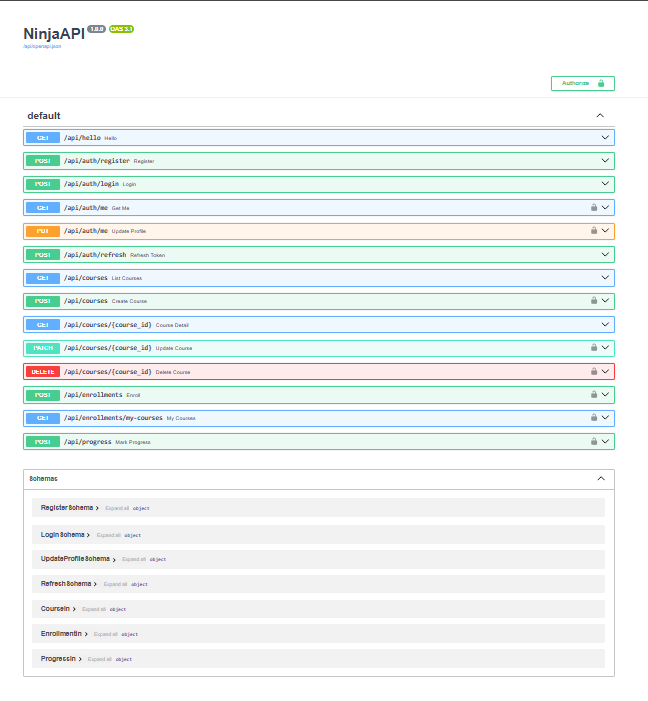
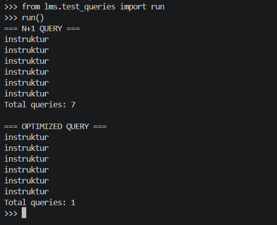
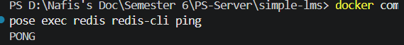
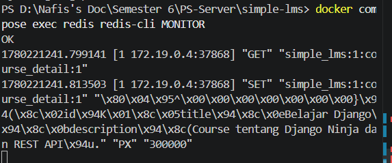
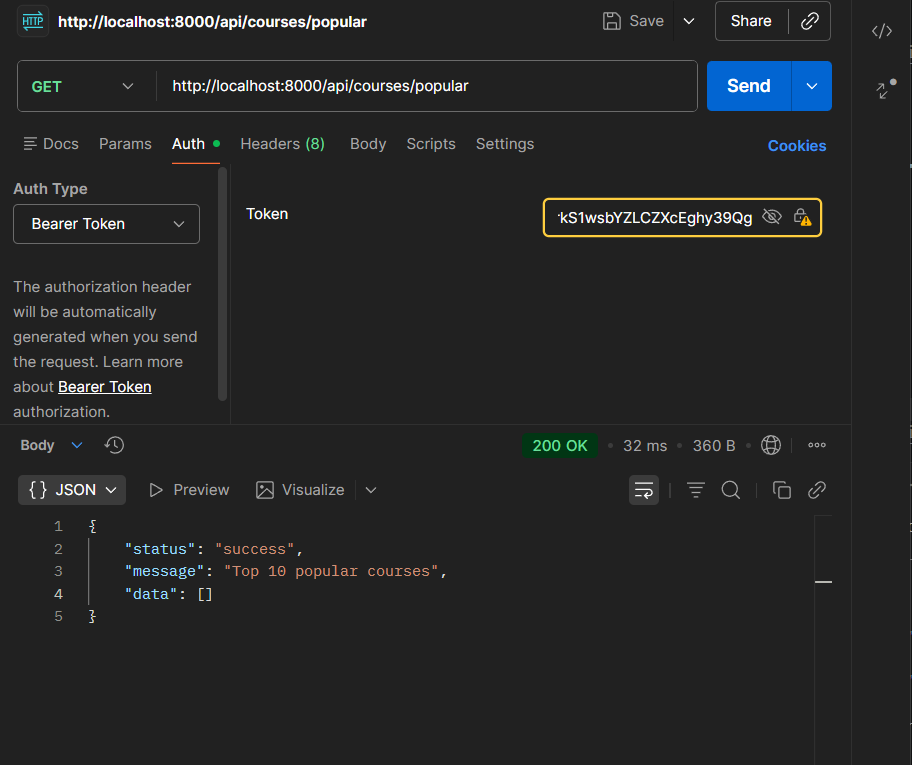
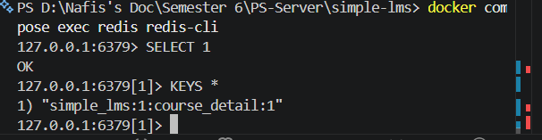

# Simple LMS - Django REST API Project

Project ini merupakan implementasi Learning Management System (LMS) menggunakan Django Ninja dengan JWT Authentication dan Role-Based Access Control (RBAC), dijalankan menggunakan Docker.

---

# Teknologi yang Digunakan

* Docker & Docker Compose
* Django + Django Ninja
* PostgreSQL
* ninja-simple-jwt (JWT Authentication)
* Pydantic Schema Validation

---

# Struktur Project

```
simple-lms/
├── docker-compose.yml
├── Dockerfile
├── .env
├── requirements.txt
├── manage.py
├── jwt-signing.pub
├── config/
│   ├── settings.py
│   ├── urls.py
│   ├── apiv1.py
│   ├── schemas.py
│   ├── permissions.py
│   ├── helpers.py
│   └── wsgi.py
├── lms/
│   ├── models.py
│   ├── admin.py
│   └── migrations/
├── postman/
│   └── simple-lms.postman_collection.json
└── img/
    └── swagger.png
```


---

# Cara Menjalankan Project

## 1. Masuk ke Folder Project

```bash
cd simple-lms
```

## 2. Jalankan Docker

```bash
docker compose up -d
```


## 3. Jalankan Migration

```bash
docker compose exec web python manage.py migrate
```


## 4. Generate RSA Keys (JWT)

```bash
docker compose exec web python manage.py make_rsa
```

## 5. Akses API Documentation

Buka browser dan akses Swagger UI:

```
http://localhost:8000/api/docs
```

---

# Konfigurasi Environment Variables

File `.env` digunakan untuk menyimpan konfigurasi:

```
DEBUG=True

DB_NAME=lms_db
DB_USER=postgres
DB_PASSWORD=postgres
DB_HOST=db
DB_PORT=5432
```


---

# API Endpoints

## Authentication

| Method | Endpoint | Deskripsi | Auth |
|--------|----------|-----------|------|
| POST | `/api/auth/register` | Register user baru | ❌ |
| POST | `/api/auth/sign-in` | Login & dapat JWT token | ❌ |
| POST | `/api/auth/token-refresh` | Refresh access token | ❌ |
| GET | `/api/auth/me` | Get profil user login | ✅ |
| PUT | `/api/auth/me` | Update profil user | ✅ |

## Courses

| Method | Endpoint | Deskripsi | Role |
|--------|----------|-----------|------|
| GET | `/api/courses` | List semua course (pagination & filter) | Public |
| GET | `/api/courses/{id}` | Detail course | Public |
| POST | `/api/courses` | Buat course baru | Instructor |
| PATCH | `/api/courses/{id}` | Update course | Owner |
| DELETE | `/api/courses/{id}` | Hapus course | Admin/Owner |

## Enrollments

| Method | Endpoint | Deskripsi | Role |
|--------|----------|-----------|------|
| POST | `/api/enrollments` | Enroll ke course | Student |
| GET | `/api/enrollments/my-courses` | Daftar course saya | Student |
| POST | `/api/enrollments/{id}/progress` | Tandai lesson selesai | Student |

---

# JWT Authentication

Project ini menggunakan `ninja-simple-jwt` dengan RSA key pair.

### Cara Login

```json
POST /api/auth/sign-in
{
  "username": "student1",
  "password": "password123"
}
```

### Response

```json
{
  "access": "eyJhbGci...",
  "refresh": "eyJhbGci..."
}
```

### Menggunakan Token

Sertakan access token di header setiap request ke protected endpoint:

```
Authorization: Bearer eyJhbGci...
```

---

# Role-Based Access Control (RBAC)

| Role | Hak Akses |
|------|-----------|
| `student` | Enroll course, lihat course, tandai progress |
| `instructor` | Semua hak student + buat & edit course miliknya |
| `admin` | Semua hak + hapus course manapun |

---

# API Documentation (Swagger)

Swagger UI tersedia di `http://localhost:8000/api/docs`



---

# Testing dengan Postman

Import file collection dari folder `postman/simple-lms.postman_collection.json` ke Postman.

### Urutan Testing yang Disarankan

1. Register akun instructor → login → simpan token
2. Buat course menggunakan token instructor
3. Register akun student → login → simpan token
4. Enroll ke course menggunakan token student
5. Tandai progress lesson menggunakan token student

---

# Screenshot

## Docker Container Running


## Query Optimization

Menggunakan `select_related` untuk menghindari N+1 problem.



---

## Redis Caching

### Verifikasi Redis Berjalan


### Cache Hit/Miss di Redis MONITOR


### Top 10 Popular Courses (Leaderboard)


### Keys tersimpan di Redis


## Fitur Caching yang Diimplementasikan

| Fitur | Keterangan |
|---|---|
| Cache-Aside | GET /api/courses/{id} dicache 5 menit |
| Cache Invalidation | Cache dihapus saat course diupdate/delete |
| Leaderboard | Top 10 course terpopuler via Redis Sorted Set |
| Session | Histori kunjungan user disimpan di Redis |

---

# Author

Nafis Aljufri
