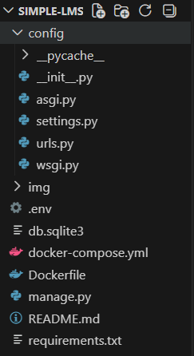
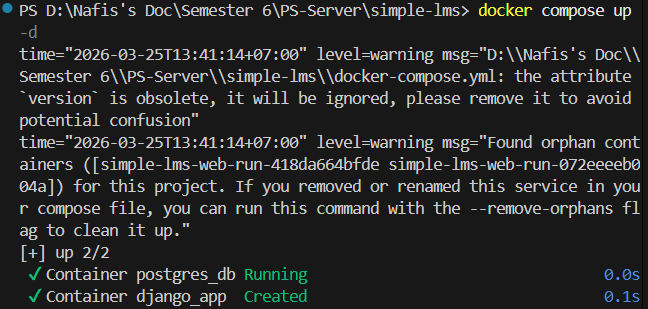
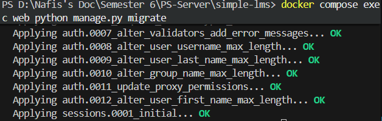
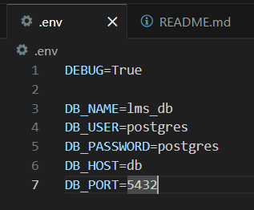
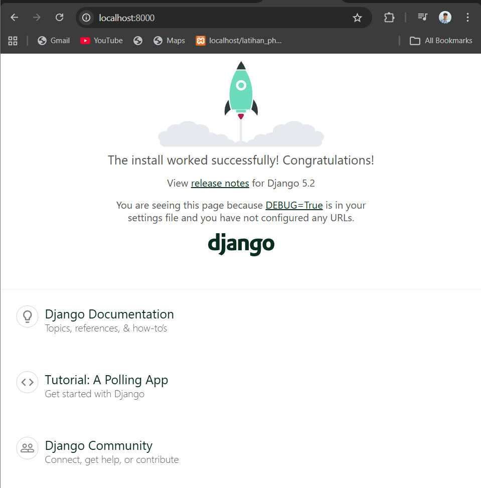
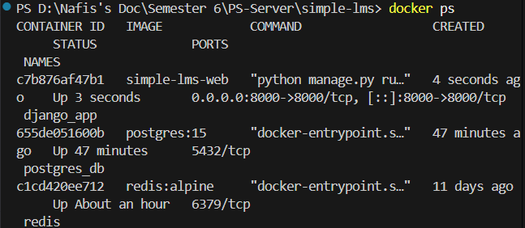

# Simple LMS - Django Docker Project

Project ini merupakan implementasi dasar Learning Management System (LMS) menggunakan Django dengan PostgreSQL sebagai database, yang dijalankan menggunakan Docker.

---

# Teknologi yang Digunakan

* Docker
* Docker Compose
* Django
* PostgreSQL

---

# Struktur Project

```
simple-lms/
├── docker-compose.yml
├── Dockerfile
├── .env
├── requirements.txt
├── manage.py
├── config/
│   ├── settings.py
│   ├── urls.py
│   └── wsgi.py
└── README.md
```

---

# Cara Menjalankan Project

## 1. Masuk ke Folder Project

```
cd simple-lms
```

---

## 2. Jalankan Docker

```
docker compose up -d
```

---

## 3. Jalankan Migration

```
docker compose exec web python manage.py migrate
```

---

## 4. Akses Aplikasi

Buka browser dan akses:

```
http://localhost:8000
```

---

# Konfigurasi Environment Variables

File `.env` digunakan untuk menyimpan konfigurasi database:

```
DEBUG=True

DB_NAME=lms_db
DB_USER=postgres
DB_PASSWORD=postgres
DB_HOST=db
DB_PORT=5432
```

---

# Screenshot

## 1. Django Welcome Page



## 2. Docker Container Running



---

# Testing & Verification

| Komponen       | Status    |
| -------------- | --------- |
| Django App     | Running   |
| PostgreSQL     | Connected |
| Docker Compose | Working   |

---

# Penjelasan Konfigurasi

## 1. Docker Compose

* **web** → menjalankan aplikasi Django
* **db** → PostgreSQL database

## 2. Database Connection

Django terhubung ke PostgreSQL melalui environment variables yang didefinisikan di file `.env`.

## 3. Volume

PostgreSQL menggunakan volume untuk menyimpan data agar tidak hilang saat container dihentikan.

---
## Query Optimization

### N+1 Problem
Query tanpa optimization menyebabkan banyak query ke database.

### Optimized Query
Menggunakan select_related mengurangi jumlah query secara signifikan.

### Hasil Perbandingan


---
# Author

Nafis Aljufri
